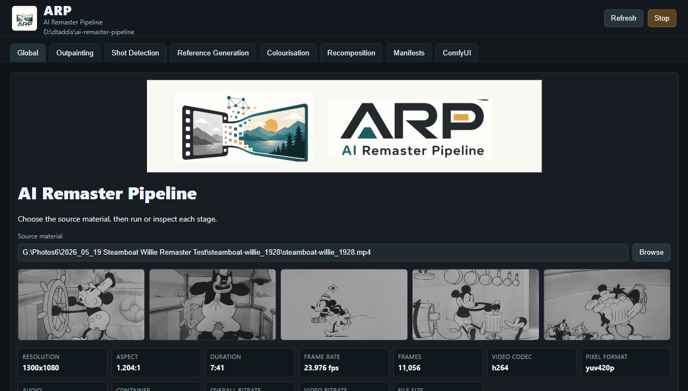

<p align="center">
  
</p>

# ARP - AI Remaster Pipeline

A staged toolkit for remastering public-domain or licensed film material with ComfyUI-assisted outpainting, shot-reference extraction, optional Qwen Image Edit still colorization, optional reference-based video colorization, and final Resolve-friendly compositing.

The pipeline is deliberately modular. Each stage writes obvious intermediate files, and the scripts use sidecar signatures plus media validation so reruns can resume completed work only when the existing files still match the expected duration, dimensions, and image/video format.

<p align="center">
  
</p>

## Folder Layout

```text
input/                                  Original movie exports or clips to process
intermediate/outpaint_prepared/        Gamma/black-lifted 16:9 clips prepared for LTX outpainting
intermediate/outpainted/                 Restored widescreen/outpainted clips from ComfyUI LTX
intermediate/outpainted_references/      B&W source reference stills selected from cuts
intermediate/outpainted_references_color/ Qwen/Comfy colorized reference stills
intermediate/outpainted_colorized/       Deep Exemplar or ColorMNet colorized video chunks
manifests/references/                    Shot/reference manifests
manifests/colorize/                      Video colorization manifests if you keep them separate
output/reassembled/                      Final reassembled/composited masters
workflows/                               ComfyUI workflow templates/placeholders
wrappers/                                Batch-file entry points
```

Runtime media and generated manifests are git-ignored by default. Commit workflow templates, scripts, docs, and small examples, not a whole movie.

## 1. Put A Movie In `input`

Place your source movie or working segment in `input`. Keep filenames descriptive, for example:

```bat
input\Metropolis_00.00.00to00.10.00_source.mp4
```

## 2. Outpainting

The LTX 2.3 outpainting LoRA fills pure black pixels. To stop it from treating genuine black pixels in the original movie as mask, prepare the input first:

```bat
outpaint_video.bat ^
  --source input\Metropolis_00.00.00to00.10.00_source.mp4 ^
  --target-aspect 16:9
```

This wraps the full outpainting stage. It lifts the source image away from pure black, centres it in the target canvas, queues the LTX 2.3 IC-LoRA outpainting workflow in ComfyUI, copies the raw ComfyUI render, and restores the lift into `intermediate/outpainted`.

Common target aspects include `16:9`, `9:16`, `4:3`, `3:4`, `1:1`, `21:9`, `2.39:1`, `2.35:1`, `1.85:1`, `3:2`, `2:3`, `5:4`, and `4:5`.

The lower-level helpers still exist if you want to prepare and restore manually: `prepare_outpaint_input.bat` and `finalize_outpaint_output.bat`.

See `docs/ltx-outpainting-prep.md` for the black-lift/gamma details.

This repo does not lock you to a single ComfyUI install. A good arrangement is:

```text
ai-remaster-pipeline/
  tools/comfyui/      optional local ComfyUI checkout or portable install
```

The `tools/` folder is ignored, so users can bring their own ComfyUI without polluting the repo.

## 3. Detect Cuts And Extract Reference Stills

```bat
generate_references.bat --source-video intermediate\outpainted\Metropolis_00.00.00to00.10.00_outpaint.mp4
```

This writes:

```text
intermediate/outpainted_references/<clip-stem>/cut_XXXX_00.MM.SS.png
manifests/references/colorize_manifest_<clip-stem>_shots_auto.csv
```

The detector compares frame structure, histograms, edges, fades, and dissolve-like changes. It writes only meaningful shot references, prunes stale screenshots by default, and can reuse existing color references if the selected frame is effectively the same after a later rerun.

Useful options:

```bat
generate_references.bat --source-video intermediate\outpainted\clip.mp4 --dry-run
generate_references.bat --source-video intermediate\outpainted\clip.mp4 --limit 10
generate_references.bat --source-video intermediate\outpainted\clip.mp4 --keep-existing-source-frames
generate_references.bat --source-video intermediate\outpainted\clip.mp4 --no-reuse-existing-references
```

## 4. Optional Still Colorization With Qwen Image Edit

Create or export a ComfyUI workflow that loads one image, runs Qwen Image Edit, and saves one image. Then run:

```bat
qwen_colorize_references.bat ^
  --manifest manifests\references\colorize_manifest_Metropolis_00.00.00to00.10.00_outpaint_shots_auto.csv ^
  --workflow workflows\qwen_image_edit\Qwen Image Edit Reference Colorize.json ^
  --load-image-node-id 1 ^
  --prompt-node-id 2 ^
  --save-node-id 9 ^
  --prompt "Colorize this image." ^
  --prompt-suffix "Modern clean restoration, natural period color, preserve composition and text."
```

The exact node IDs depend on your workflow. For normal exported ComfyUI workflows, widget selectors are usually numeric indexes like `0`; for API-format workflows, they can be input names. If ComfyUI is not under `tools\comfyui`, add `--comfy-output-root D:\dtaddis\ComfyUI\output` or wherever your Comfy output folder lives. The script patches the input image, prompt, and save prefix, then copies ComfyUI's result to the `color_reference` path in the manifest.

## 5. Optional Video Colorization

The repository provides a lightweight wrapper for the reference-video colorization runner rather than hard-coding one person's ComfyUI graph:

```bat
colorize_video.bat --manifest manifests\references\colorize_manifest_clip_shots_auto.csv --method DeepExemplar
```

By default it looks for:

```text
tools/comfyui/scripts/colorize_manifest_runner.py
```

You can point it at your own known-good runner with `--comfy-runner`.

## 6. Final Composite / Reassembly

The finishing idea is:

1. Bottom: widescreen outpainted video.
2. Middle: original source video centered over it, feathered at the left/right edges to preserve as much real footage as possible.
3. Top: optional colorized video as a color/detail overlay with adjustable saturation and temperature.

```bat
final_composite.bat ^
  --outpainted intermediate\outpainted\clip_outpaint.mp4 ^
  --source input\clip_source.mp4 ^
  --colorized intermediate\outpainted_colorized\clip_colorized.mp4 ^
  --output output\reassembled\clip_final.mp4 ^
  --feather-pixels 80 ^
  --saturation 0.82 ^
  --temperature -0.015
```

The FFmpeg blend is an approximation of a Resolve-style color layer. For final grading, Resolve is still the more comfortable place to finesse saturation, coolness, grain, and masks.

## Resume Behavior

Scripts write `.sig.json` sidecars beside outputs. If inputs and settings match, a rerun reuses the existing output. If a source video, source frame, prompt, workflow, or relevant parameter changes, the dependent output is regenerated.

## GUI

The repo also includes a cross-platform local web GUI for running and inspecting the pipeline:

```bat
launch_gui.bat
```

On macOS or Linux, use:

```sh
./launch_gui.sh
```

Or, from an activated Python environment on any platform:

```bat
python -m ai_remaster_gui
```

The GUI keeps the command-line scripts as the backend, so anything you configure in the tabs is shown as an equivalent command before it runs. It includes:

- A Global tab with whole-pipeline progress and a one-shot run button.
- Stage tabs for outpainting, shot detection, Qwen reference generation, video colourisation, and recomposition.
- Image/video preview panes for intermediate files in each stage folder.
- A manifest editor for enabling/disabling references and adjusting reference paths.
- A ComfyUI tab for queue inspection and optional log-file tailing.

The GUI stores local field history in `.ai_remaster_gui.json`, which is ignored by Git.

When launched, the GUI checks whether ComfyUI is available at `http://127.0.0.1:8188`. If it is not running and `.ai_remaster_config.json` points at a valid ComfyUI directory, the GUI starts ComfyUI in a separate process/window with this repo's `.venv`. Set `AI_REMASTER_NO_COMFY_AUTOSTART=1` to disable that behavior.

## Branding

Logo and thumbnail assets live in `assets/branding`:

- `arp-logo.png` for the README and general project branding.
- `arp-logo-wide.png` for the GUI Global page.
- `arp-app-icon-512.png`, `arp-app-icon-192.png`, `favicon.png`, and `favicon.ico` for the GUI/browser icon.
- `arp-github-social.png` for the GitHub repository social preview image.

## Installation

For a full Windows setup, run:

```bat
install_windows.bat
```

The installer will ask whether to clone ComfyUI into this project or use an existing ComfyUI directory. Existing installs are expected to contain `main.py`; the installer will then add the required custom nodes, model folders, and models. Python packages are installed into this repo's `.venv`, not into the ComfyUI directory.

For unattended installs, pass the ComfyUI directory explicitly or use the default clone location:

```bat
install_windows.bat -ComfyDir D:\somewhere\ComfyUI
install_windows.bat -NonInteractive
```

Depending on your choice, that script either creates `tools\comfyui` or uses your existing ComfyUI folder. It creates this repo's `.venv`, writes the local `.ai_remaster_config.json`, installs local FFmpeg/ffprobe tools under `.cache/tools/ffmpeg`, installs CUDA PyTorch, ComfyUI requirements, ComfyUI Manager, LTXVideo nodes, and Deep Exemplar / ColorMNet reference colorization nodes.

Models and LoRAs are downloaded on demand when their pipeline stages first need them:

- LTX 2.3 FP8 checkpoint.
- LTX 2.3 text encoder and audio VAE.
- LTX 2.3 distilled LoRA used by the bundled outpainting workflow.
- LTX 2.3 outpainting IC-LoRA.
- Qwen Image Edit 2509 FP8 diffusion model.
- Qwen image text encoder and VAE.
- Qwen Image Edit Lightning 4-step LoRA.

Useful installer options:

```bat
install_windows.bat -SkipDeepExemplar
install_windows.bat -ComfyDir D:\somewhere\comfyui
install_windows.bat -TorchIndexUrl https://download.pytorch.org/whl/cu128
install_windows.bat -DownloadModels
```

Model downloads are huge and resumable. By default they happen on demand; pass `-DownloadModels` if you want the installer to prefetch the main model set. If a file already exists at the expected destination, the downloader skips it. See `docs/installer-model-sources.md` for the exact Hugging Face repo/file mapping.

The installer places FFmpeg and ffprobe under `.cache/tools/ffmpeg`; command-line scripts can still use a system FFmpeg from PATH or an explicit `--ffmpeg` where supported.
## Licensing Notes

Check the licenses for every model and workflow you use. This repo is only orchestration code; it does not grant commercial rights to source films, LoRAs, Qwen models, Deep Exemplar, ColorMNet, or any other model weights.
## Qwen Continuity Lessons

The Qwen still-colourisation stage now follows the lessons from the HotB restoration work: use Qwen as a single-image edit, do not pass multiple reference images directly, and use text descriptions for continuity instead. `--add-prompt` is appended last, and `--print-final-prompt` shows exactly what the workflow receives.

Optional local continuity guidance:

```bat
qwen_colorize_references.bat --manifest manifests\references\clip.csv --workflow workflows\qwen_image_edit\Qwen.json --load-image-node-id 1 --prompt-node-id 2 --save-node-id 9 --reference-description-provider ollama --ollama-vision-model qwen2.5vl:7b --continuity-reference-count 3
```

Single still repair:

```bat
generate_single_reference.bat --source-image intermediate\outpainted_references\clip\cut_0014.png --output intermediate\outpainted_references_color\clip\cut_0014.png --workflow workflows\qwen_image_edit\Qwen.json --load-image-node-id 1 --prompt-node-id 2 --save-node-id 9 --add-prompt "brown hair, no added text"
```

