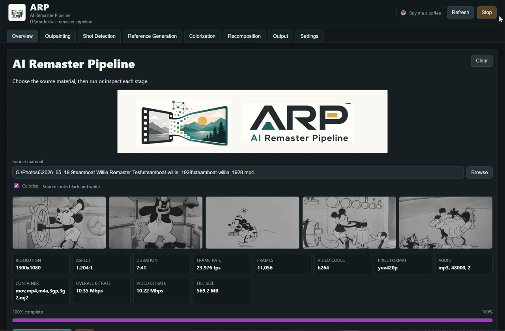
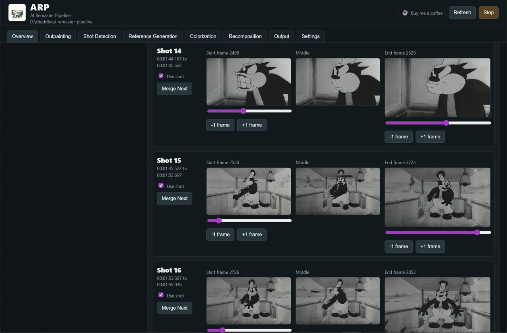
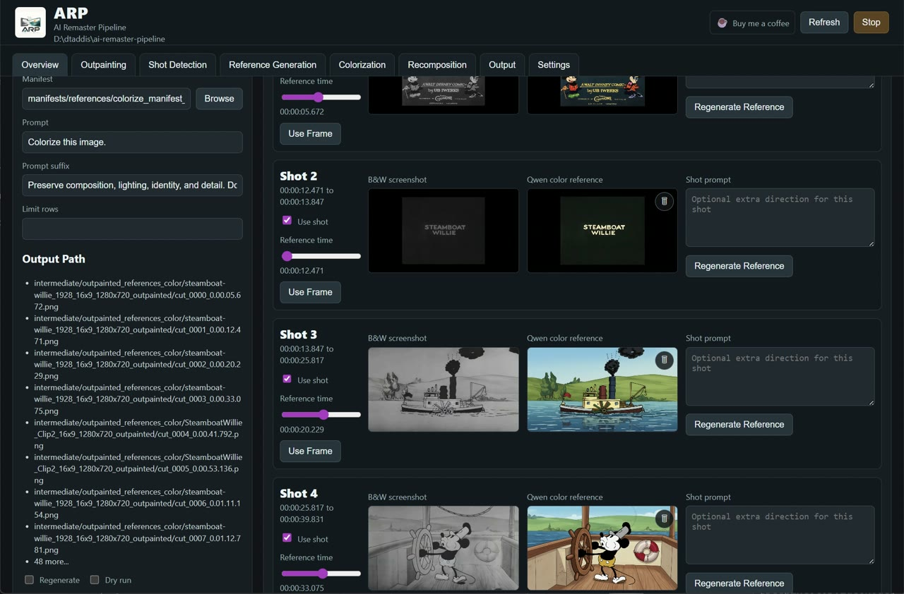
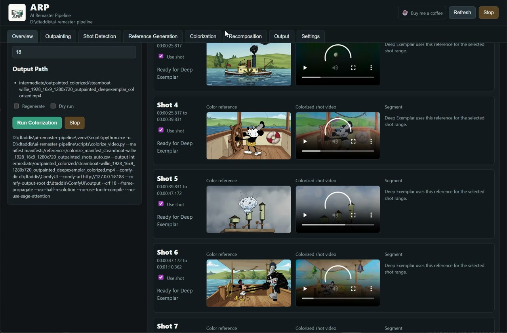
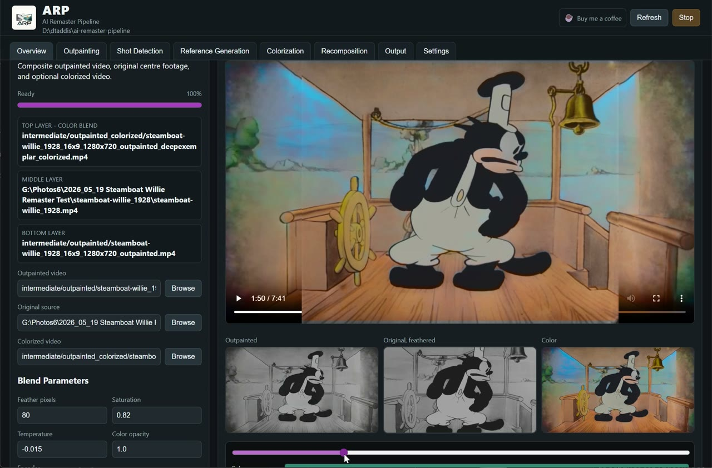
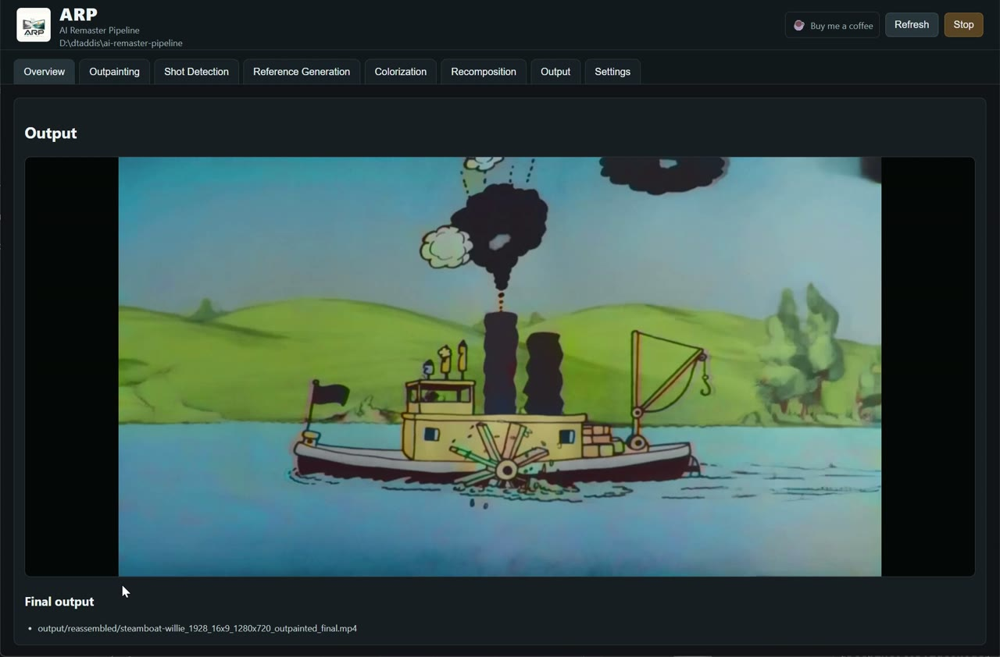

<p align="center">
  
</p>

# ARP - AI Remaster Pipeline

ARP is a local GUI app for remastering public-domain or properly licensed film material with ComfyUI-powered AI tools.

It is built around an old-film workflow: choose a black-and-white source movie, outpaint it to a wider aspect ratio, detect shots, generate color reference stills, colorize the outpainted video from those references, and finally recomposite the result so the original center footage stays as faithful as possible.

The app is still alpha software, but the goal is simple: you should be able to run the whole remaster from the GUI, then inspect and adjust each stage when the AI needs a little human steering.

<p align="center">
  
</p>

## What It Does

- Outpaints 4:3 or similar archive footage into common target aspect ratios such as `16:9`, `9:16`, `4:3`, `3:4`, `1:1`, `21:9`, `2.39:1`, and `1.85:1`.
- Splits video into shots and lets you review, merge, enable, disable, and adjust shot boundaries.
- Generates per-shot reference frames and colorizes them with Qwen Image Edit.
- Uses reference-guided video colorization for the outpainted footage.
- Recombines the original, outpainted, and colorized layers into a final output.
- Keeps intermediate files deterministic and resumable, so reruns can reuse valid existing work.

## Install

### Requirements

- Windows with an NVIDIA GPU is the currently supported installer path. The installer defaults to CUDA 12.8 PyTorch wheels.
- Python 3.13 is required. On Windows, install it from [python.org](https://www.python.org/downloads/) with the Python Launcher option enabled, or make sure `python.exe` is on `PATH`.
- Git is required so the installer can clone ComfyUI and the ComfyUI custom nodes.
- Internet access is required during installation for Python packages, ComfyUI/custom-node repositories, FFmpeg, and optional model downloads.
- ComfyUI is required as the AI backend. The installer can clone it for you, or you can point ARP at an existing ComfyUI checkout.

### Windows

Run:

```bat
install_windows.bat
```

The installer creates this repo's `.venv`, installs FFmpeg locally, and asks whether to clone ComfyUI into `tools\comfyui` or use an existing ComfyUI directory.

If the installer cannot find Python 3.13, it will prompt you to install it and retry detection.

If Python 3.13 is installed somewhere custom, point the installer at the actual executable. Common python.org install paths are:

```bat
install_windows.bat -PythonLauncher "%LocalAppData%\Programs\Python\Python313\python.exe"
install_windows.bat -PythonLauncher "C:\Program Files\Python313\python.exe"
```

If you already have ComfyUI somewhere else:

```bat
install_windows.bat -ComfyDir D:\path\to\ComfyUI
```

Python packages are installed into ARP's `.venv`, not into your ComfyUI virtual environment. ComfyUI itself is used as the AI backend.

Models and LoRAs are downloaded on demand when a stage first needs them. If a large Hugging Face download is interrupted, rerun the same stage and the download should resume. You can prefetch the main model set with:

```bat
install_windows.bat -DownloadModels
```

Useful installer options:

```bat
install_windows.bat -NonInteractive
install_windows.bat -SkipDeepExemplar
install_windows.bat -TorchIndexUrl https://download.pytorch.org/whl/cu128
```

See [docs/installer-model-sources.md](docs/installer-model-sources.md) for the exact model and LoRA sources.

### macOS And Linux

The full installer is currently Windows-focused. On macOS or Linux, set up a Python virtual environment, install `requirements.txt`, configure an existing ComfyUI directory in `.ai_remaster_config.json`, and launch the GUI with `./launch_gui.sh` or `python -m ai_remaster_gui`.

Cross-platform packaging is planned, but not polished yet.

## Launch The GUI

On Windows:

```bat
launch_gui.bat
```

On macOS or Linux:

```sh
./launch_gui.sh
```

Or from an activated environment:

```sh
python -m ai_remaster_gui
```

The GUI opens as a local web app. It checks ComfyUI at `http://127.0.0.1:8188`; if ComfyUI is configured but not running, ARP can start it in a separate process/window.

Set `AI_REMASTER_NO_COMFY_AUTOSTART=1` if you want to manage ComfyUI yourself.

## Basic Workflow

1. Open the Overview tab.
2. Choose your source material with Browse.
3. Check the preview frames, duration, resolution, frame rate, codecs, and color/monochrome guess.
4. Leave Colorize enabled for black-and-white sources, or turn it off if you only want outpainting.
5. Click Run Whole Remaster for a first pass.
6. Use the stage tabs to inspect or rerun individual phases.

Every stage writes predictable intermediate files under `intermediate/`, manifests under `manifests/`, and final renders under `output/reassembled/`.

## Tabs

### Overview

Choose the source video, see useful media info, and run the whole pipeline.


### Outpainting

Set the target aspect ratio, output height, chunk length, overlap frames, and source crop. The target preview helps you see where ARP will add new canvas before LTX fills it.

Outpainting is chunked so longer movies can be processed without requiring a huge single ComfyUI job. ARP defaults to 8 overlap frames because LTX can return short chunks; lower values may still work, but the app warns you when the overlap is risky.

Outpainting is the slowest stage. On local GPUs, a 20 second 720p-ish LTX chunk can still take several minutes, and 10 minutes is not automatically a sign that something is broken. Very short chunk lengths multiply the number of ComfyUI jobs, so use the default 20 seconds unless you need a cut at a precise point. If outpainting fails immediately with a missing `LTXVImgToVideoConditionOnly` node, re-run the installer for the same ComfyUI directory and restart ComfyUI so `ComfyUI-LTXVideo` is installed and loaded.

### Shot Detection

Review the detected shots, inspect start/middle/end frames, merge shots that should share a reference, and nudge shot boundaries frame by frame.



### Reference Generation

Pick the reference time inside each shot, regenerate individual Qwen color references, delete references you do not like, and add short per-shot prompt notes.



### Colorization

Review each shot's color reference alongside the corresponding colorized video segment. This stage uses the generated references to guide video colorization.



### Recomposition

Preview and tune the final blend: outpainted video at the bottom, original source in the center with feathered edges, and the colorized layer contributing chroma on top.



### Output

Once recomposition finishes, the Output tab plays the final render.



### Settings

Settings contains ComfyUI connection details, queue/log inspection, and global pipeline defaults that are useful but too noisy for the main stage tabs.

## ComfyUI And Models

ARP uses ComfyUI as the backend for the AI-heavy stages. The current intended stack includes:

- LTX 2.3 distilled GGUF Q4_K_M for lightweight outpainting.
- LTX 2.3 IC outpainting LoRA.
- Qwen Image Edit 2511 GGUF Q4_K_M for still reference colorization.
- Qwen Image Edit Lightning LoRA.
- Deep Exemplar reference-guided video colorization.

The repo stores orchestration code, GUI code, workflows, wrappers, docs, and small assets. Runtime media, model caches, ComfyUI installs, and generated outputs are ignored by Git.

## Folder Layout

```text
input/                                   Optional source clips
intermediate/outpaint_prepared/          Expanded/lifted clips prepared for LTX
intermediate/outpainted/                 Widescreen/outpainted clips
intermediate/outpainted_references/      Per-shot black-and-white reference stills
intermediate/outpainted_references_color/ Qwen colorized reference stills
intermediate/outpainted_colorized/       Reference-guided colorized video
manifests/references/                    Shot/reference manifests
output/reassembled/                      Final composited masters
workflows/                               ComfyUI workflow templates
wrappers/                                Batch/shell entry points
assets/branding/                         Logo, icons, and GitHub artwork
assets/screenshots/                      README screenshots
```

## Resume Behavior

ARP writes `.sig.json` sidecars beside generated outputs. If inputs and settings still match, a rerun can reuse existing work. If the source, prompt, workflow, crop, aspect ratio, or other relevant setting changes, the dependent output is regenerated.

The GUI is also designed around deterministic intermediate paths. When one stage completes, the next stage's input fields are populated automatically.

## Direct Script Use

The GUI is the recommended way to use ARP, but the backend scripts are still normal command-line tools. If you want to wire ARP into your own pipeline, look in `wrappers/` for entry points such as `outpaint_video.bat`, `generate_references.bat`, `qwen_colorize_references.bat`, `colorize_video.bat`, and `final_composite.bat`.

Those scripts are what the GUI calls internally, and the GUI shows the equivalent command before running a stage.

## Licensing Notes

Check the licenses for every model, workflow, and source film you use. This repo is orchestration software; it does not grant rights to source films, model weights, LoRAs, ComfyUI custom nodes, Qwen models, Deep Exemplar, or other third-party components.
