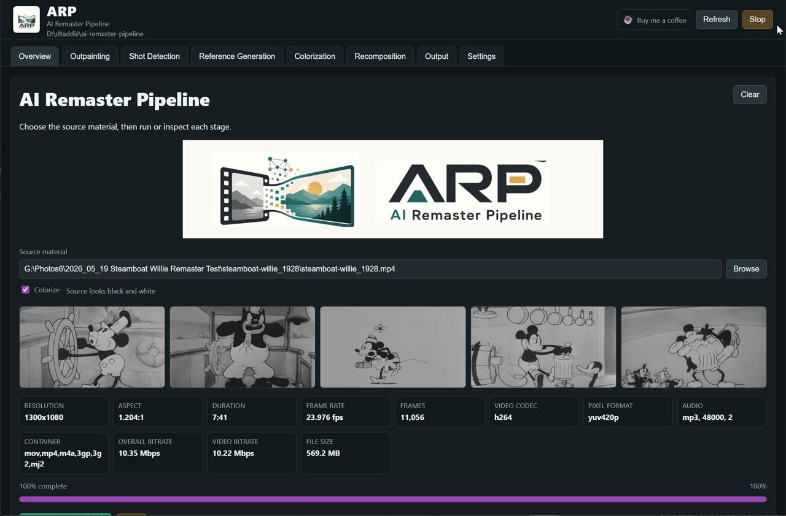
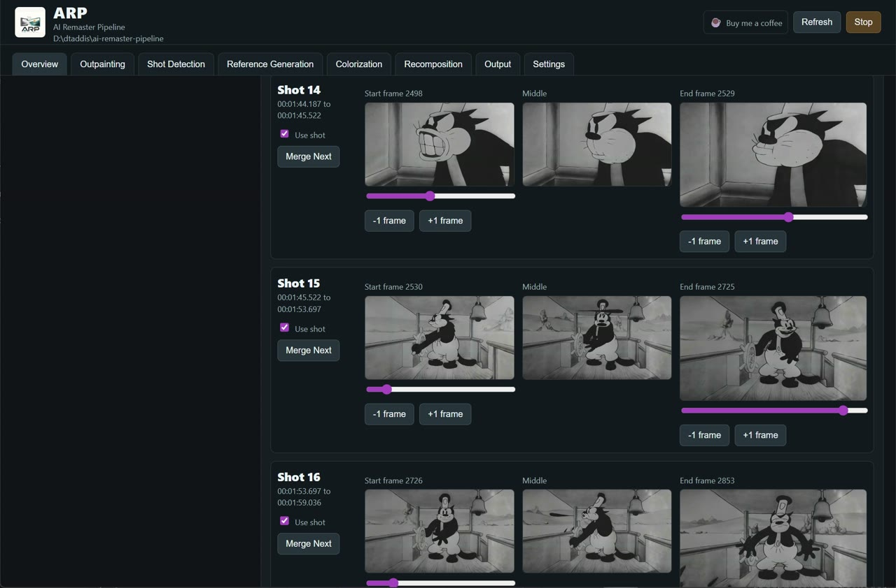
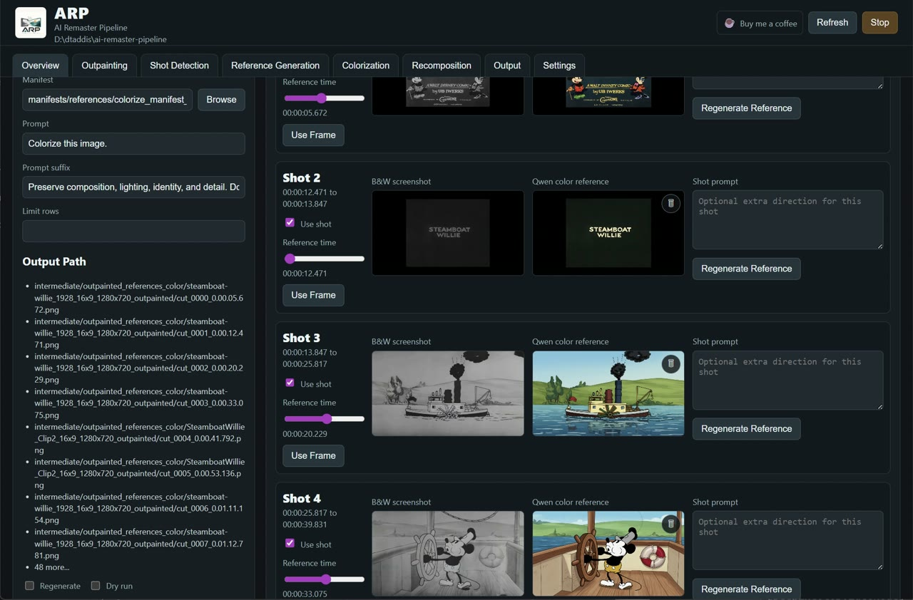
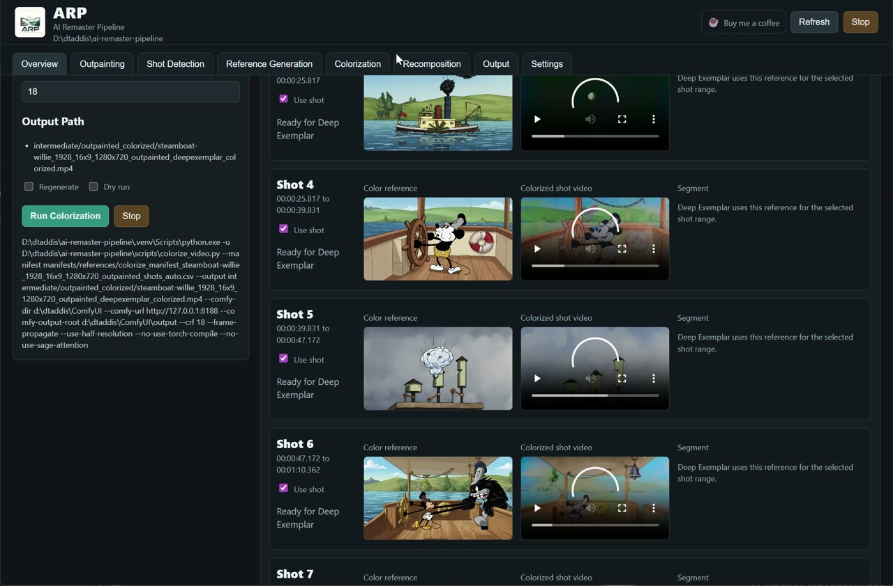
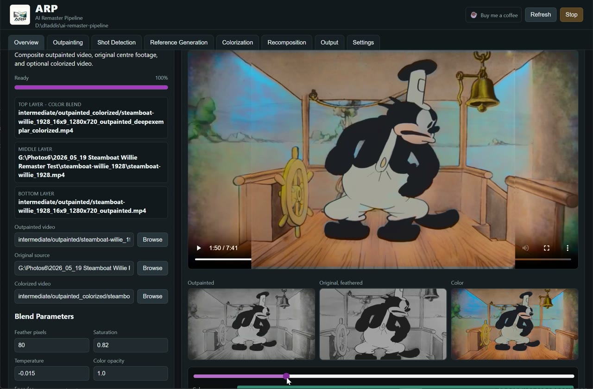
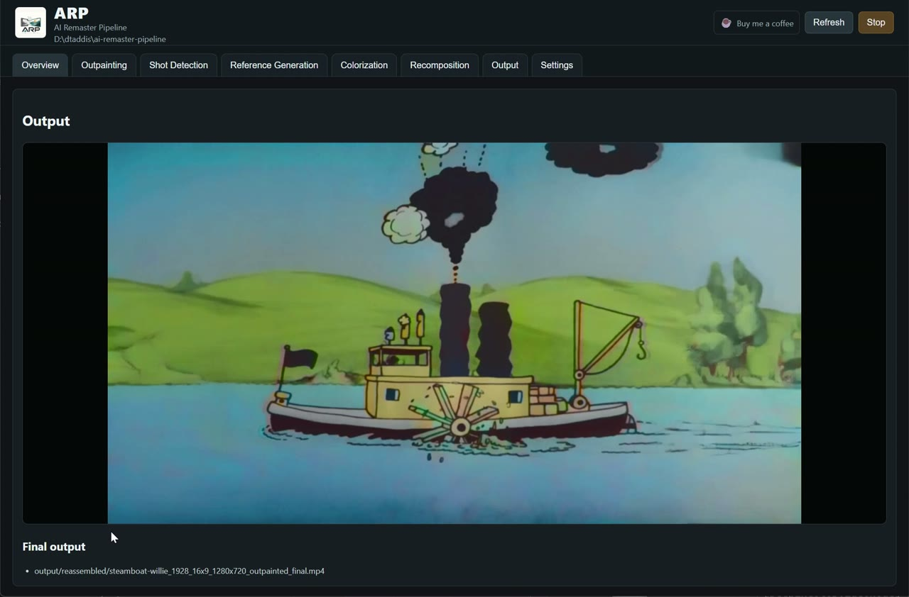

<p align="center">
  
</p>

# ARP - AI Remaster Pipeline

ARP is a local GUI app for remastering public-domain or properly licensed film material with ComfyUI-powered AI tools.

It is built around an old-film workflow: choose source material, optionally clean archive damage and stabilize gate weave per shot, outpaint it to a wider aspect ratio, detect shots, generate color reference stills, colorize the video from those references, and finally recomposite the result so the original center footage stays as faithful as possible.

The app is still alpha software, but the goal is simple: you should be able to run the whole remaster from the GUI, then inspect and adjust each stage when the AI needs a little human steering.

<p align="center">
  
</p>

## What It Does

- Outpaints 4:3 or similar archive footage into common target aspect ratios such as `16:9`, `9:16`, `4:3`, `3:4`, `1:1`, `21:9`, `2.39:1`, and `1.85:1`.
- Splits video into shots and lets you review, merge, enable, disable, and adjust shot boundaries.
- Generates per-shot reference frames and colorizes them with Qwen Image Edit.
- Optionally reconstructs vertical scratches with masked ProPainter inpainting, corrects light/dark vignettes, then restores archive footage with the LTX 2.3 Dearchive LoRA at a selectable model-safe output resolution (720p by default).
- Uses reference-guided video colorization for the outpainted footage.
- Recombines the original, outpainted, and colorized layers into a final output.
- Keeps intermediate files deterministic and resumable, so reruns can reuse valid existing work.

## Install

### Requirements

- Windows with an NVIDIA GPU is the currently supported installer path. The installer defaults to CUDA 12.8 PyTorch wheels.
- Python 3.13 is required. On Windows, install it from [python.org](https://www.python.org/downloads/) with the Python Launcher option enabled, or make sure `python.exe` is on `PATH`.
- Git is required so the installer can clone and update ARP's managed ComfyUI runtime and required custom nodes.
- Internet access is required during installation for Python packages, ComfyUI, FFmpeg, and optional model downloads.
- ComfyUI is required as the AI backend. The installer can clone it for you, or you can point ARP at an existing ComfyUI checkout.

#### Hardware And Storage Planning

ARP is a large, compute-intensive workflow. These are planning figures rather than hard limits because memory use and render time depend heavily on the enabled stages, working resolution, chunk length, and model settings:

- **GPU:** 16 GB of NVIDIA VRAM is a practical floor for conservative settings and lower working resolutions. **24 GB is recommended** and is the basis for defaults such as 720p AI DeScratch. 48 GB or more gives useful headroom for higher resolutions, longer chunks, and less aggressive tiling.
- **System RAM:** 32 GB is a practical minimum; **64 GB is recommended**, particularly when large model components are offloaded from the GPU.
- **Installation and models:** allow roughly 15 GB for the Python/ComfyUI runtime before models, and about **85-100 GB** for the main video, image, and LoRA model set. Models are downloaded only when a stage needs them, so a partial workflow uses less.
- **Free disk space:** start with at least **150 GB free** for installation and the main models. **250 GB or more is recommended** when running complete projects. The Hugging Face download cache can temporarily retain another copy of large model files, and intermediate videos can consume tens or hundreds of gigabytes depending on source length, resolution, and enabled stages.

AI processing is normally much slower than the source running time, and resolution alone is not enough to predict it reliably. Benchmark the intended settings on a representative 10-30 second section, multiply that stage's elapsed time by the ratio of full duration to test duration, then allow additional time for review and regenerated chunks. Short tests may take minutes to hours; a feature-length, multi-stage restoration can take days to months. Moving from 720p to 1080p can increase both time and memory use substantially.

### Windows

Run:

```bat
install_windows.bat
```

The installer creates this repo's `.venv`, installs FFmpeg locally, and uses an ARP-managed ComfyUI checkout at `tools\comfyui`.

That managed checkout is the recommended path. Re-running `install_windows.bat` refreshes ComfyUI and the required custom nodes with fast-forward Git updates, while preserving downloaded models and generated outputs.

If the installer cannot find Python 3.13, it will prompt you to install it and retry detection.

If Python 3.13 is installed somewhere custom, point the installer at the actual executable. Common python.org install paths are:

```bat
install_windows.bat -PythonLauncher "%LocalAppData%\Programs\Python\Python313\python.exe"
install_windows.bat -PythonLauncher "C:\Program Files\Python313\python.exe"
```

If you intentionally want to use an existing ComfyUI checkout instead:

```bat
install_windows.bat -ComfyDir D:\path\to\ComfyUI
```

When you pass `-ComfyDir`, ARP treats that checkout as external: it can install/update required custom nodes there, but it will not update ComfyUI core itself. Keep external ComfyUI checkouts current yourself with `git pull` and `pip install -r requirements.txt`.

Python packages are installed into ARP's `.venv`, not into a separate ComfyUI virtual environment. The managed ComfyUI checkout is used as the AI backend.

Models and LoRAs are downloaded on demand when a stage first needs them. If a large Hugging Face download is interrupted, rerun the same stage and the download should resume. You can prefetch the main model set with:

```bat
install_windows.bat -DownloadModels
```

ARP respects Hugging Face's `HF_HOME` and `HF_HUB_CACHE` environment variables. You can also set
`ARP_HF_CACHE_DIR` for an ARP-specific cache override. For an existing ComfyUI installation, model
downloads also follow the default section of `extra_model_paths.yaml`, including its
`download_model_base` setting.

Useful installer options:

```bat
install_windows.bat -NonInteractive
install_windows.bat -SkipDeepExemplar
install_windows.bat -InstallCorrelationExtension
install_windows.bat -TorchIndexUrl https://download.pytorch.org/whl/cu128
```

ColorMNet and CMNET2 use a PyTorch correlation fallback by default with the same output quality. `-InstallCorrelationExtension` attempts the optional faster CUDA correlation extension for ColorMNet; it requires Visual Studio C++ Build Tools and a local CUDA Toolkit matching the installed PyTorch CUDA build. If the extension cannot build, installation continues in fallback mode. The installer also downloads CMNET2's checkpoint and DINOv2/ResNet support files into the ignored runtime directories under `vendor/cmnet2`.

See [docs/installer-model-sources.md](docs/installer-model-sources.md) for the exact model and LoRA sources.

### macOS And Linux

The full installer is currently Windows-focused. On macOS or Linux, set up a Python virtual environment, install `requirements.txt`, configure an existing ComfyUI directory in `.ai_remaster_config.json`, and launch the GUI with `./launch_gui.sh` or `python -m ai_remaster_gui`.

Cross-platform packaging is planned, but not polished yet.

## Launch The GUI

On Windows:

```bat
launch_gui.bat
```

On macOS or Linux:

```sh
./launch_gui.sh
```

Or from an activated environment:

```sh
python -m ai_remaster_gui
```

The GUI opens as a local web app. It checks ComfyUI at `http://127.0.0.1:8188`; if ComfyUI is configured but not running, ARP can start it in its own console window so you can watch ComfyUI load and render in real time.

ComfyUI runs in that separate console window, where its startup, progress, and any import/custom-node errors are visible live. ARP also records the launch command to `output/logs/comfyui-startup.log` (viewable from Settings → Log file).

Set `AI_REMASTER_NO_COMFY_AUTOSTART=1` if you want to manage ComfyUI yourself.

## Basic Workflow

1. Open the Overview tab.
2. Choose your source material with Browse. Select one video, or select a numbered image sequence (PNG, BMP, JPG/JPEG, DPX, TIFF, or WebP). Set **Image sequence FPS** before browsing, or change it afterward to rebuild the sequence timing. Image sequences are sorted naturally by filename, converted to a 10-bit lossless FFV1 working master, and given a browser-playable preview automatically.
3. Check the preview frames, duration, resolution, frame rate, codecs, and color/monochrome guess.
4. Enable Clean Up when the source needs archive restoration, and Stabilize when it has gate weave, jitter, or unwanted frame rotation; both default off. Inside Clean Up, select any combination of AI DeScratch, DeVignette, and Dearchive. Leave Colorize enabled for black-and-white sources, or turn it off if you only want cleanup/stabilization/outpainting.
5. Click Run Whole Remaster for a first pass.
6. Use the stage tabs to inspect or rerun individual phases.

Every stage writes predictable intermediate files under `intermediate/`, manifests under `manifests/`, and final renders under `output/reassembled/`.

## Tabs

### Overview

Choose the source video, see useful media info, and run the whole pipeline.


### Clean Up

Optional and off by default. Clean Up has three independent operations. **AI DeScratch** builds a visible scratch-only mask, reconstructs only those pixels across neighbouring frames with ProPainter, and composites them back over the untouched source; it is also off by default. DeVignette estimates stationary dark falloff or a pale additive edge veil while preserving black presentation bars. Dearchive applies the LTX 2.3 IC-LoRA and defaults on. Its resolution selector defaults to 720p (rounded to the nearest LTX-safe dimensions), and the finished Dearchive file stays at that model resolution rather than being enlarged back to the source dimensions.

The order is DeVignette, AI DeScratch, then Dearchive. AI DeScratch defaults to a 720p working copy and 41-frame windows on a 24 GB GPU, but always returns the source resolution and timing. Sensitivity controls how faint a vertical mark may be before it enters the mask; mask expansion includes damaged edges around each detected line. Enable the mask preview to write a companion `_scratch_mask.mp4`; white shows the detected base mask, before the selected expansion margin. ProPainter's model and upstream code use the NTU S-Lab License 1.0 and are restricted to non-commercial use.

DeVignette defaults to **Auto (prefer GPU)**. ARP uses its installed PyTorch CUDA stack directly and processes frames in adaptive batches when an NVIDIA GPU is available; otherwise it logs the reason and falls back to OpenCV/NumPy on the CPU. The log reports the selected processor, GPU name, batch size, sampled-frame analysis time, frames per second, elapsed time, and ETA.

When Dearchive is enabled it defaults to 4.04-second chunks (97 frames at 24 fps); the UI accepts 2 to 20 seconds and rounds the requested duration at the source frame rate to the nearest LTX-valid `8n + 1` frame count. **Source Fidelity** controls the strength of the complete input-video IC-LoRA guide. Its safe default of `1.0` preserves the source most exactly, while lower values let Dearchive repaint more damage at increasing risk of changes to faces, hands, motion, and fine period detail. Every combination returns a video with the source resolution, sample aspect ratio, frame rate, frame count, and audio. The passes preserve colour; aspect-ratio expansion and delivery scaling happen only in later phases.

### Stabilization

Optional and off by default. Stabilization uses FFmpeg's two-pass libvidstab filters to estimate and correct translation and rotation. ARP first detects shot boundaries with the same detector used by Reference Generation, then analyses every shot independently so cuts and dissolves are not interpreted as camera movement. An existing user-reviewed shot manifest takes precedence when available. Smoothing, maximum translation/rotation, fixed safety zoom, and shot sensitivity are adjustable; ARP does not use automatic zoom, so framing cannot pulse or silently crop much more than requested. FFV1 is the default mathematically lossless intermediate; ProRes HQ is available for editing workflows. Stabilization runs after Clean Up and before Outpainting or Colorization.

### Outpainting

Set the target aspect ratio, output height, chunk length, overlap frames, and source crop. The target preview helps you see where ARP will add new canvas before LTX fills it.

Outpainting is chunked so longer movies can be processed without requiring a huge single ComfyUI job. ARP defaults to 8 overlap frames because LTX can return short chunks; lower values may still work, but the app warns you when the overlap is risky.

The model selector offers the established official LTX 2.3 v0.9 graph, its legacy Oumoumad variant, and optional LTX 2.5 two-stage outpainting. LTX 2.5 uses a Q4_K_M distilled transformer, separately offloaded Q5 text encoder, convolutional VAE, and official latent upscaler to fit a 24 GB GPU with useful activation headroom. Its recommended 24 fps mode motion-interpolates lower-rate archival material without changing duration; source cadence remains available when interpolation is undesirable.

ARP derives a frame-aligned binary mask from the prepared canvas. **Generation mask overlap** expands only the mask seen by LTX beneath protected source pixels, preventing very thin requested bands from surviving as the green inpaint sentinel after spatial compression. The final Laplacian composite uses the exact requested crop mask and the untouched prepared source—not the green conditioning image—so the hidden overlap cannot leak into the result. Pure-white mask pixels are selected at full resolution after the pyramid boundary blend, ensuring even a very thin top or bottom strip is taken from the generated image. **Mask seam blend** adjusts only the surrounding boundary transition. The models are gated on Hugging Face: access must first be accepted in the browser for the same individual account used by ARP. Authenticate with `hf auth login --force` (or `HF_TOKEN`) if the saved token still receives a 403.

Outpainting is the slowest stage. On local GPUs, a 20 second 720p-ish LTX chunk can still take several minutes, and 10 minutes is not automatically a sign that something is broken. Very short chunk lengths multiply the number of ComfyUI jobs, so use the default 20 seconds unless you need a cut at a precise point.

If outpainting fails immediately with missing `LTXVInpaintPreprocess`, `LTXVLaplacianPyramidBlend`, or `LTXAddVideoICLoRAGuideAdvanced` nodes, fully close ComfyUI, re-run `install_windows.bat`, choose the same ComfyUI directory, then restart ARP/ComfyUI. These nodes come from [ComfyUI-LTXVideo](https://github.com/Lightricks/ComfyUI-LTXVideo), which should live in `ComfyUI\custom_nodes\ComfyUI-LTXVideo`. ARP also uses [ComfyUI-GGUF](https://github.com/city96/ComfyUI-GGUF), installed to `ComfyUI\custom_nodes\ComfyUI-GGUF`, for the lightweight GGUF models.

If you use ComfyUI portable, select either the inner folder that contains `main.py` or the portable parent folder; ARP will look for `ComfyUI\main.py` inside it.

### Shot Detection

Review the detected shots, inspect start/middle/end frames, merge shots that should share a reference, and nudge shot boundaries frame by frame.



### Reference Generation

Pick the primary reference frame inside each shot, regenerate individual Qwen/OpenAI colour references, delete references you do not like, and add short per-shot prompt notes. For a long pan or another continuity shot, choose **Add Reference**, then scrub that reference's own frame slider to the exact source frame and select **Use Frame**. Additional reference frames remain part of the same shot rather than creating artificial cuts.



### Colorization

Review each shot's colour references alongside the corresponding colourized video segment. **CMNET2** preloads every reference frame for a shot into permanent memory and is the local multi-reference option. **OpenAI Cloud** also receives every reference. ColorMNet and Deep Exemplar deliberately use Reference 1 only.

Because Dearchive can introduce colour of its own, ARP converts extracted source stills and the video stream back to neutral grayscale before reference generation and before Deep Exemplar, ColorMNet, or CMNET2. The generated colour reference stays in colour and guides the selected model as usual. OpenAI Cloud is the exception: it may retain existing colour evidence when enhancing footage.



### Recomposition

Preview and tune the final blend: outpainted video at the bottom, original source in the center with feathered edges, and the colorized layer contributing chroma on top.

**Reference luminance matching** compares each approved colour reference with its original black-and-white reference and derives a bounded tonal curve for that shot. The compositor applies one fixed curve across the entire shot before adding colour chroma, which brings the moving lighting and contrast closer to the reference without introducing frame-by-frame exposure flicker. It defaults to 70% strength so source shadow and highlight detail remain protected; disable it to retain the original monochrome luminance exactly.



### Output

Once recomposition finishes, the Output tab plays the final render.



### Upscaling and source motion

The Upscaling page offers two backends. **FlashVSR** remains the fast, established refiner. **LTX 2.5 Pixel Spatial** uses Lightricks' official 2x IC-LoRA with the 2.5 distilled transformer; it synthesizes fine detail from a half-resolution reference and is therefore slower and more creative. Preview identity-critical archival shots before committing to the LTX path. Its gated LoRA downloads on first use after Hugging Face access has been accepted for `Lightricks/LTX-2.5-22b-IC-LoRA-Pixel-Spatial-Upscaler`.

FlashVSR can make motion look unnaturally crisp when it reconstructs every frame without the source exposure blur. **Default AI upscale strength** controls a final blend between the full AI render and a conventional Lanczos resize of the same source. Lowering it restores source-derived motion blur and reduces the stop-motion quality without synthesizing new ghost trails.

After Shot Detection, the Upscaling page also exposes this strength per shot. A hard cut switches strength on the cut; a transition marked **Fading transition** in Shot Detection interpolates the strength across the configured crossfade duration. The full-strength AI render is cached separately, so changing only these blend decisions does not rerun the upscale.

### Settings

Settings contains ComfyUI connection details, queue/log inspection, and global pipeline defaults that are useful but too noisy for the main stage tabs.

## ComfyUI And Models

ARP uses ComfyUI as the backend for the AI-heavy stages. The current intended stack includes:

- LTX 2.3 distilled GGUF Q4_K_M for lightweight outpainting.
- CUDA-accelerated automatic light/dark DeVignette correction for optional archive repair.
- Masked ProPainter video inpainting for optional AI DeScratch (non-commercial NTU S-Lab licence).
- LTX 2.3 Dearchive IC-LoRA for optional generative archive cleanup.
- Configurable 540p/720p/1080p/source Dearchive processing with exact source-size delivery.
- Official LTX 2.3 v0.9 in/outpainting IC-LoRA (full-resolution mask-conditioned pass).
- LTX 2.5 Pixel Spatial Upscaler 2x IC-LoRA as an alternative to FlashVSR.
- Qwen Image Edit 2511 GGUF Q4_K_M for still reference colorization.
- Qwen Image Edit Lightning LoRA.
- Deep Exemplar reference-guided video colorization.
- ColorMNet single-reference and CMNET2 multi-reference video colorization.
- Optional OpenAI Cloud per-frame colour enhancement with resumable caching.

The repo stores orchestration code, GUI code, workflows, wrappers, docs, and small assets. Runtime media, model caches, ComfyUI installs, and generated outputs are ignored by Git.

ARP bundles the ComfyUI workflow JSONs it needs to queue jobs:

- `workflows/cleanup_ltx/DeArchive.json` for LTX Dearchive cleanup.
- `workflows/outpaint_ltx/outpaint_LTX-IC.json` for LTX IC outpainting.
- `workflows/qwen_image_edit/Image Edit (Qwen 2511).json` for Qwen Image Edit reference frames and outpaint guide frames.

Deep Exemplar and ColorMNet video colourisation do not use saved workflow JSON files; ARP builds those ComfyUI API prompts directly from the selected source, manifest, and method. CMNET2 runs directly through its bundled Python runtime rather than ComfyUI. ComfyUI itself and model weights remain external dependencies. ARP bundles the required custom-node packages and CMNET2 runtime source where their licenses allow redistribution; see `vendor/comfyui_custom_nodes/README.md` and `vendor/cmnet2/README.md`.

## Folder Layout

```text
input/                                   Optional source clips
intermediate/cleaned/                    Clean Up outputs at the selected Dearchive resolution
intermediate/stabilized/                 Lossless, scene-aware stabilization outputs
intermediate/outpaint_prepared/          Expanded/lifted clips prepared for LTX
intermediate/outpainted/                 Widescreen/outpainted clips
intermediate/outpainted_references/      Per-shot black-and-white reference stills
intermediate/outpainted_references_color/ Qwen colorized reference stills
intermediate/outpainted_colorized/       Reference-guided colorized video
manifests/references/                    Shot/reference manifests
output/reassembled/                      Final composited masters
workflows/                               Bundled ComfyUI workflows used by ARP
vendor/comfyui_custom_nodes/             Bundled ComfyUI custom nodes used by ARP
wrappers/                                Batch/shell entry points
assets/branding/                         Logo, icons, and GitHub artwork
assets/screenshots/                      README screenshots
```

## Resume Behavior

ARP writes `.sig.json` sidecars beside generated outputs. If inputs and settings still match, a rerun can reuse existing work. If the source, prompt, workflow, crop, aspect ratio, or other relevant setting changes, the dependent output is regenerated.

The GUI is also designed around deterministic intermediate paths. When one stage completes, the next stage's input fields are populated automatically.

## Direct Script Use

The GUI is the recommended way to use ARP, but the backend scripts are still normal command-line tools. If you want to wire ARP into your own pipeline, look in `wrappers/` for entry points such as `cleanup_video.bat`, `stabilize_video.bat`, `outpaint_video.bat`, `generate_references.bat`, `qwen_colorize_references.bat`, `colorize_video.bat`, and `final_composite.bat`.

Those scripts are what the GUI calls internally, and the GUI shows the equivalent command before running a stage.

## Licensing Notes

Check the licenses for every model, workflow, and source film you use. This repo is orchestration software; it does not grant rights to source films, model weights, LoRAs, ComfyUI custom nodes, Qwen models, Deep Exemplar, or other third-party components.
